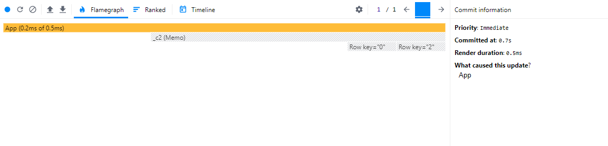

# Make React Fast Again Part 1: Reconciliation and Component Design

## React can be fast

It's a shame that there is no style guide for React. One of the biggest mistakes that is made, almost without fail, is poor performance. The core architecture of many apps inevitably out-scale themselves. React apps start fine, but slowly accumulate performance problems. Poor architectural decisions make it slow. There is nothing inherently wrong with React.

Good architecture can be learned. But it requires a deep understanding of React, data structure mutations, and applying tried-and-true design patterns to component design. The first step is to learn what the [virtual DOM](https://legacy.reactjs.org/docs/faq-internals.html) is and the [reconciliation algorithm](https://legacy.reactjs.org/docs/reconciliation.html).

## The Virtual DOM

The virtual DOM is React’s approach to high-performance DOM changes. The virtual DOM is an un-rendered representation of the previous DOM state. When a change occurs, optimal transformation strategies are performed by comparing the virtual DOM to the DOMs next incoming state.

The comparison process utilizes the reconciliation algorithm. The DOM diffing process of a mounted component is commonly referred to as a rerender. When a component rerenders, its child components (at all levels of nesting) also trigger render cycles. Render cycles are triggered when React-managed data is updated (usually with the [`useState`](https://react.dev/reference/react/useState) hook).

This rendering strategy can create crippling performance issues in large applications. Rerender propagation is an obfuscated process for the untrained eye. When, why, and where rerenders are is lost in the sauce for large applications.

Rerenders are not inherently bad. After all, they are necessary for an application to be responsive. It is when rerenders occur many times and, most importantly, when they are triggered in unnecessary places.

## Leveraging React Developer Tools

Discovering performance woes is easy (fixing them is another story) with the browser extension [React Developer Tools](https://chromewebstore.google.com/detail/react-developer-tools/fmkadmapgofadopljbjfkapdkoienihi?pli=1). It has a performance profiler that visualizes component render cycles, via flame graph.

To visualize this, a small application is needed. This app has a button that increments a counter and a basic table implementation. Note that this table, on a conceptual level, is unrelated to the button and its incrementing UI.

```jsx
import React, { useState } from "react";
import ReactDOM from "react-dom";

const App = () => {
  const [counter, setCounter] = useState(0);

  return (
    <div>
      <button onClick={() => setCounter((prev) => prev + 1)}>
        increment ({counter})
      </button>
      <Table />
    </div>
  );
};

const Table = () => (
  <table>
    <tbody>
      {Array(5)
        .fill(null)
        .map((_, i) => (
          <Row idx={i} key={i} />
        ))}
    </tbody>
  </table>
);

const Row = ({ idx }) => (
  <tr>
    <td>{idx}</td>
  </tr>
);

ReactDOM.render(
  <App />,
  // assuming you have an html file with a <div id="root" />
  document.getElementById("root")
);
```

A button click triggers a render cycle by invoking `setCounter`. Visually, `App` has experienced a DOM update. But reconciliation is diffing more DOM nodes than one might expect.

No `props` are passed down to `Table` and `Row`. It is fundamentally impossible for these components be affected by `App`'s state change. But cascading rerenders to child components is the default behavior. Updating `App` causes reconciliation to trigger in unnecessary locations. This consumes precious resources on the client.


Imagine one state change triggering useless render cycles on hundreds DOM elements. What if something trivial like an `input` did this on every keystroke? This is the silent killer of enterprise software.

There is a de facto solution exists for useless rerender suppression: `React.memo`. It performs a shallow equality check (JavaScript's strict equality operator) on all incoming `props` from the parent component. In the sample code, simply wrapping the child components with it suppresses the useless rerenders.

```jsx
import React, { useState } from "react";
import ReactDOM from "react-dom";

const App = () => {
  // ...
};

const Table = React.memo(() => (
  // ...
));

const Row = React.memo(({ idx }) => (
  // ...
));

ReactDOM.render(
  <App />,
  // assuming you have an html file with a <div id="root" />
  document.getElementById("root")
);
```

The flame graph has changed. There are now gray cells. These represent components that did not rerender during a particular render cycle in the app.



It would be naive to think that we're done. Any professional developer knows that this example looks nothing like enterprise software. We need to develop a full-scale architecture in order to leverage the power of `React.memo` in apps that render thousands of DOM nodes and trigger hundreds of heavy render cycles (possibly thousands) per minute.

## Check out the demo

Seeing is believing. The rest of the article will refer to an basic app. It can be run in a local environment, which is available in this [repo](https://github.com/andrew1007/mrfa-demo/tree/main) (type definitions included).

## God components are slow

In order to see what a fast implementation looks like, first we need to look at one that is slow.

Here is the god component of a searchable, filterable, and selectable table using local state. The local state data management system forces the creation of a god component. The topmost component must manage all data and event handlers. Data needs to be repeatedly passed down from the top of the component hierarchy.

```jsx
import { useEffect, useState } from "react";
import Filter from "./Filter";
import Table from "./Table";
import { fetchColumns, fetchFilters, fetchRows } from "../resources/requests";

const App = () => {
  const [rows, setRows] = useState([]);
  const [columns, setColumns] = useState([]);
  const [filters, setFilters] = useState([]);
  const [searchText, setSearchText] = useState("");
  const [focusedFilter, setFocusedFilter] = useState("");
  const [selected, setSelected] = useState([]);

  // load data from mock api on mount
  useEffect(() => {
    Promise.all([fetchRows(), fetchFilters(), fetchColumns()]).then(
      ([rows, filters, columns]) => {
        setRows(rows);
        setColumns(columns);
        setFilters(filters);
      }
    );
  }, []);

  // compute which rows match the current search + filter criteria
  const getFilteredRows = () => {
    const currentFilter = filters.find(({ id }) => id === focusedFilter);
    if (!currentFilter && !searchText) {
      return rows;
    }

    return rows
      .filter(
        (row) =>
          currentFilter?.conditions.every(
            (cond) => row[cond.key] === cond.value
          ) ?? true
      )
      .filter(({ name }) => name.includes(searchText));
  };

  // update text in cell
  const handleCellEdit = ({ id, key, value }) => {
    setRows((prevRows) => {
      return prevRows.map((row) => {
        if (row.id === id) {
          return { ...row, [key]: value };
        }
        return row;
      });
    });
  };

  // toggle a row checkbox
  const toggleCheckChange = (id) => (e) => {
    if (e.target.checked) {
      return setSelected((prevSelected) => [...prevSelected, id]);
    } else {
      return setSelected((prevSelected) =>
        prevSelected.filter((selectedId) => selectedId !== id)
      );
    }
  };

  // toggle checkbox that selects/deselects all
  const toggleCheckAll = () => {
    if (selected.length === rows.length) {
      setSelected([]);
    } else {
      setSelected(rows.map(({ id }) => id));
    }
  };

  return (
    <>
      <Filter
        options={filters}
        onFilterChange={setFocusedFilter}
        onSearchChange={setSearchText}
        searchText={searchText}
      />
      <Table
        rows={getFilteredRows()}
        columns={columns}
        selected={selected}
        onEditCell={handleCellEdit}
        onCheck={toggleCheckChange}
        onAllCheck={toggleCheckAll}
      />
    </>
  );
};
```

Inspecting the flame graph reveals useless rerenders. On checkbox select and selecting new filter conditions, a rerender of the entire table occurs. When inspecting the props that are passed from `App` down to `Table`, it is fundamentally impossible to ever suppress rerenders; even if `Table` is wrapped in a `React.memo`. `getFilteredRows()`, `handleCellEdit`, `toggleCheckChange`, and `toggleCheckAll` fail reference equality on every render cycle.


Technically, `useCallback` and `useMemo` could be used to retain reference equality. But these should be avoided. They are brittle to use and must be vigilantly maintained. These hooks rely on a dependency array, which is susceptible to ineffective memoization and/or stale values. Liberal use of them inevitably become liabilities in large applications. All of these issues and considerations are a non-issue if a different data management design pattern is used. It starts by managing data outside of the component hierarchy: the Context API.
