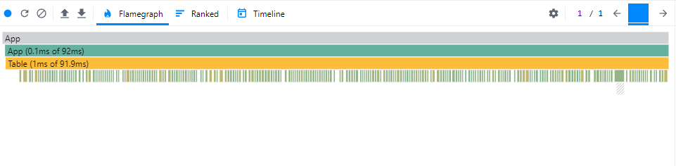

# God Component Performance

## Introduction

In order to see what a fast implementation looks like, first we need to look at one that is slow.

God components are a consequence of a developer's path of least resistance. It's alluring to build what is convenient in the present. But it is not sustainable in the long term. This design harms maintainability. They also, without fail, accumulate performance issues.

## Check out the demo

Seeing is believing. The rest of the articles will refer to a basic app. It can be run in a local environment, which is available in this [repo](https://github.com/andrew1007/mrfa-demo/tree/main) (type definitions included).

## God components are slow

This god component is a searchable, filterable, and selectable table. The local state data management system forces the creation of a god component. The topmost component must manage all data and event handlers. Data needs to be repeatedly passed down from the top of the component hierarchy.

```jsx
import { useEffect, useState } from "react";
import Filter from "./Filter";
import Table from "./Table";
import { fetchColumns, fetchFilters, fetchRows } from "../resources/requests";

const App = () => {
  const [rows, setRows] = useState([]);
  const [columns, setColumns] = useState([]);
  const [filters, setFilters] = useState([]);
  const [searchText, setSearchText] = useState("");
  const [focusedFilter, setFocusedFilter] = useState("");
  const [selected, setSelected] = useState([]);

  // load data from mock api on mount
  useEffect(() => {
    Promise.all([fetchRows(), fetchFilters(), fetchColumns()]).then(
      ([rows, filters, columns]) => {
        setRows(rows);
        setColumns(columns);
        setFilters(filters);
      }
    );
  }, []);

  // compute which rows match the current search + filter criteria
  const getFilteredRows = () => {
    const currentFilter = filters.find(({ id }) => id === focusedFilter);
    if (!currentFilter && !searchText) {
      return rows;
    }

    return rows
      .filter(
        (row) =>
          currentFilter?.conditions.every(
            (cond) => row[cond.key] === cond.value
          ) ?? true
      )
      .filter(({ name }) => name.includes(searchText));
  };

  // update text in cell
  const handleCellEdit = ({ id, key, value }) => {
    setRows((prevRows) => {
      return prevRows.map((row) => {
        if (row.id === id) {
          return { ...row, [key]: value };
        }
        return row;
      });
    });
  };

  // toggle a row checkbox
  const toggleCheckChange = (id) => (e) => {
    if (e.target.checked) {
      return setSelected((prevSelected) => [...prevSelected, id]);
    } else {
      return setSelected((prevSelected) =>
        prevSelected.filter((selectedId) => selectedId !== id)
      );
    }
  };

  // toggle checkbox that selects/deselects all
  const toggleCheckAll = () => {
    if (selected.length === rows.length) {
      setSelected([]);
    } else {
      setSelected(rows.map(({ id }) => id));
    }
  };

  return (
    <>
      <Filter
        options={filters}
        onFilterChange={setFocusedFilter}
        onSearchChange={setSearchText}
        searchText={searchText}
      />
      <Table
        rows={getFilteredRows()}
        columns={columns}
        selected={selected}
        onEditCell={handleCellEdit}
        onCheck={toggleCheckChange}
        onAllCheck={toggleCheckAll}
      />
    </>
  );
};
```

Inspecting the flame graph reveals useless rerenders. On checkbox select and selecting new filter conditions, a rerender of the entire table occurs. When inspecting the props that are passed from `App` down to `Table`, it is fundamentally impossible to ever suppress rerenders; even if `Table` is wrapped in a `React.memo`. `getFilteredRows()`, `handleCellEdit`, `toggleCheckChange`, and `toggleCheckAll` fail reference equality on every render cycle.



Technically, `useCallback` and `useMemo` could be used to retain reference equality. But these should be avoided. They are brittle to use, must be vigilantly maintained, and oftentimes ineffective. Liberal use of them inevitably become liabilities in large applications. All of these issues and considerations are a non-issue if a different data management design pattern is used. It starts by managing data outside of the component hierarchy: the Context API.
