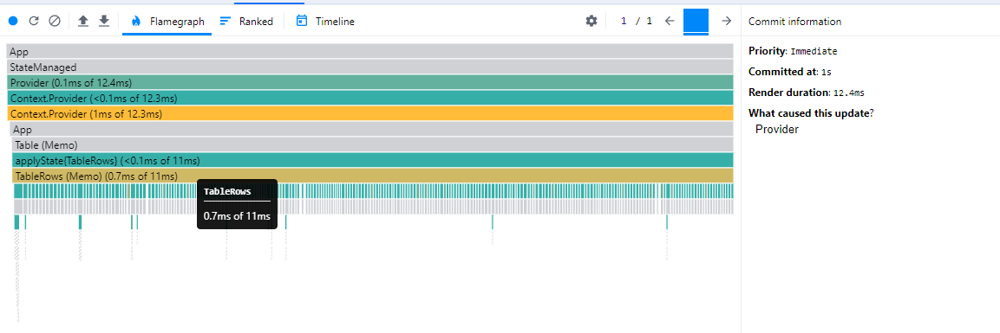

## Optimized Component Design

With the prerequisite knowledge out of the way, component design can be explored. Designing optimized components is about creating a logical separation of UI elements based on the data they use. Component size is not the causation of optimized components; it is a correlation.

### Reference data using ids

Make no mistake: passing data down from parent to child is oftentimes required. However, making strategic decisions on what to pass down is the difference between the optimized and naive approach.

In a majority of cases, only `id` needs to be passed down from parent to child. The `id` can be used inside `applyState`'s function resolver to find the necessary data. This concept will be leveraged heavily. For simplicity, the code snippet doesn't include the search/filtering algorithm.

```jsx
const TableRows = ({ rowIds }) => (
  <>
    {rowIds.map((id) => (
      <TableRow id={id} key={id} />
    ))}
  </>
);

const mappedState = () => (state) => ({
  rowIds: state.rowIds,
});

export default applyState(mappedState)(TableRows);
```

In the components that only receive `id` from the parent, `state` is accessed in `applyState`'s function resolver to get the specific `row`'s data.

```jsx
const TableRow = (props) => <div />;

const mappedState = () => (state, ownProps) => ({
  value: state.rows[ownProps.id],
});

export default applyState(mappedState)(RowCell);
```

### Compute to primitives outside of UI

Primitive data types are easy to optimize because JavaScript's strict equality checks them by value. When possible, reduce data down to primitives outside of UI. In `RowCheckbox`, computing the `checked` status in `applyState` is an easy win. The `boolean` value only changes when that specific checkbox changes state. The array of selected checkboxes updates on state change of any checkbox. If the array were passed to the component, every checkbox would rerender, regardless of whether or not its `checked` state has changed.

```jsx
const RowCheckbox = (props) => {
  const { checked } = props;

  // Don't worry about this handler. We're concentrating on the pre-computation aspect of this code snippet
  const toggleCheck = (e) => null;

  return <input onChange={toggleCheck} type="checkbox" checked={checked} />;
};

const mappedState = () => (state, ownProps) => ({
  checked: state.selected.includes(ownProps.id),
});

export default applyState(mappedState)(RowCheckbox);
```

### Isolate un-optimizable UI

The rendered rows is dynamic because of searching and filtering. This requires the `rowIds` to recompute on every render cycle, which guarantees strict equality failure. This useless rerender is virtually unavoidable (at least for now). In this situation, where optimization is not possible, isolate this algorithm from the rest of the system. Be mindful of this component's children `props` to minimize propagating render cycles.

```jsx
const TableRows = ({ rowIds }) => (
  <>
    {rowIds.map((id) => (
      <TableRow id={id} key={id} />
    ))}
  </>
);

const getFilteredRowIds = (state) => {
  const { filters, focusedFilter, rows } = state;
  const { conditions } = filters.find(({ id }) => id === focusedFilter);

  return rows
    .filter((row) => conditions.every((cond) => row[cond.key] === cond.value))
    .map(({ id }) => id);
};

const mappedState = () => (state) => ({
  rowIds: getFilteredRowIds(state),
});

export default applyState(mappedState)(TableRows);
```

This design allows rerenders to constantly fire with no performance penalties. The flame graph shows a miniscule 0.7 ms render speed.



### Isolate zero-dependency and static UI

UI that do not accept nor provide `props` never have a reason to rerender after initial mount. In this case, a subset of the `table` HTML are static and never need to be diffed for changes. The React components (`AllCheckbox`, `TableColumns`, `TableRows`) have no parent `props`. `Table` will never be a source of rerenders for them. All these can be grouped together into one component. Remember to wrap these types of components in `React.memo`.

```jsx
const Table = () => {
  return (
    <table>
      <thead>
        <tr>
          <td>
            <AllCheckbox />
          </td>
          <TableColumns />
        </tr>
      </thead>
      <tbody>
        <TableRows />
      </tbody>
    </table>
  );
};

export default React.memo(Table);
```

### Tightly scope event handlers and data

In most cases, it is better to have data close to the UI that use it. `RowCell` is a good case study for how this can be done. Create event handlers and extract `state` data in the locations where they are used. Oftentimes, only `id` is necessary. But in the case of individual cells, the name of the column is also required. The `TableRow` needs to pass down the column name, which requires `TableRow` to know what `columns` to render.

```jsx
const TableRow = ({ columns, id }) => (
  <tr>
    <td>
      <RowCheckbox id={id} />
    </td>
    {columns.map(({ key }) => (
      <RowCell key={key} field={key} id={id} />
    ))}
  </tr>
);

const mappedState = () => (state) => ({
  columns: state.columns,
});

export default applyState(mappedState)(TableRow);
```

With all necessary identifiers provided, the data to render can be parsed inside `applyState`'s function resolver. The value is a string, which suppresses useless rerenders.

```jsx
const RowCell = (props) => {
  const { value, id, field } = props;
  const dispatch = useDispatch();

  const handleEdit = (value) => {
    dispatch((prevState) => {
      const nextRows = { ...prevState.rows };
      nextRows[id] = {
        ...nextRows[id],
        [field]: value,
      };

      return {
        rows: nextRows,
      };
    });
  };

  return <EditableCell value={value} onConfirm={handleEdit} />;
};

const mappedState = () => (state, ownProps) => {
  const { rows } = state;
  const { field, id } = ownProps;
  return {
    value: rows[id][field],
  };
};

export default applyState(mappedState)(RowCell);
```

## Conclusions

This design approach is, without a doubt unconventional. 
