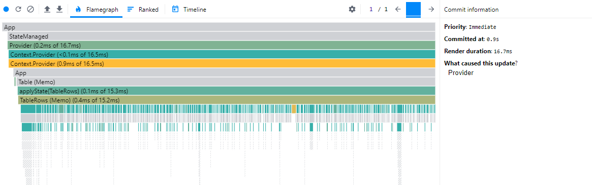

## Performance scaling

Rerender overhead of typical architectures scale linearly. If rerenders are not suppressed, twice the HTML means reconciliation diffs twice the number of DOM nodes. This is compounded by algorithms in the code. But these are non-issues with rerender suppression strategies. In many cases, complexity increases have negligible impact on an application's responsiveness.

This is observable by analyzing the table when its complexity grows.

As resource requirements increase, the god component component's responsiveness scales into the stratosphere. The optimized app, on the other hand, is resistant to scaling increases.

Here is a comparison for ticking the table's "All" checkbox. With the unoptimized app, render time is 32.6 ms.


In the optimized app, it is a render speed of 16.7 ms. A substantial improvement.


To see how it truly scales, we can insert an algorithm to artificially slow down the app. The following function will be run in every cell on each render cycle.

```javascript
const heavy = () => {
  for (let i = 0; i < 100; i++) {
    JSON.stringify({});
  }
};
```

Here are how the render cycle speed changes, as the number of iterations increases. Any responsiveness slower than 50 ms is typically considered to be intrusive to the user experience. The unoptimized app almost immediately hurts the user experience.

| Iterations | Optimized (ms) | Unoptimized (ms) |
| ---------- | -------------- | ---------------- |
| 100        | 16.7           | 32.6             |
| 200        | 21.7           | 46.2             |
| 300        | 26.6           | 58.2             |
| 400        | 31.5           | 78.2             |
| 500        | 35.3           | 85.7             |
| 1000       | 61.1           | 165              |
| 1250       | 74.1           | 198.7            |
| 1500       | 85.1           | 231.8            |
| 1750       | 94.6           | 258.7            |
| 2000       | 106            | 303.7            |


## Avoid Algorithms Inside UI

Front-loading algorithms in `applyState`, which always recomputes, may seem like an unnecessary use of client resources. If individual subtrees of `state` were passed into the component and then computed inside, useless computations would be circumvented. For example, if the algorithm in `getFilteredRows` existed inside `TableRows`, strict equality would be met more often (as opposed to never met).

```jsx
const TableRows = (props) => {
  const { filters, focusedFilter, searchText, rows, rowIds } = props;
  const currentFilter = filters.find(({ id }) => id === focusedFilter);

  const filteredRowIds = rowIds
    .filter(
      (rowId) =>
        currentFilter?.conditions.every(
          (cond) => rows[rowId][cond.key] === cond.value
        ) ?? true
    )
    .filter((rowId) => rows[rowId].name.includes(searchText));

  return (
    <>
      {filteredRowIds.map((id) => {
        return <TableRow id={id} key={id} />;
      })}
    </>
  );
};

const mappedState = () => (state) => {
  const { filters, focusedFilter, searchText, rowIds, rows } = state;
  return { filters, focusedFilter, searchText, rowIds, rows };
};

export default applyState(mappedState)(TableRows);
```

This true, but impractical. Maintainability comes first for enterprise software. Algorithms in UI violate separation of concerns and are not reusable. On top of that, there is already a solution for this. Functional (pure) memoization strategies enable patterns that are robust, extremely effective (when used correctly), and reusable. There is no denying that memoization has performance penalties. But the impact is normally small and provides massive increases in scalability. It is almost always worth it.

## Commenting on the React Compiler

There is plenty of talk about a new feature: The [React Compiler](https://react.dev/learn/react-compiler). It markets itself as the answer to suppressing useless rerenders "for free". But there are limits to what it can do. Poorly-designed apps have useless rerenders embedded within their DNA. No novel technology (short of sophisticated AI code refactoring) will ever fix foundational performance issues. A technology like this is not a free pass to be undisciplined.

On top of that, a subset of the skills required for a fast React app are platform-agnostic. Any technology, library, or framework will benefit from this knowledge.

## To be continued

With these concepts, typical web apps gain substantial amounts of responsiveness. But there are more performance wins that build on top of mindful component design, resulting in hyper-optimized applications. The following will take performance to a level that most developers have never seen in enterprise software.

- Structuring normalized state trees
- Robust memoization strategies for computed data
- Dispatching optimal state transformations
