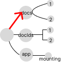

# State tree mutations and selector traversal

## Seeing State as a Tree

This section will discuss how to see `state` as a tree data structure. The transformation and node access are the central points of interest. From personal experience, this tends to be the easiest way to intuitively create a mental model of how `state` transforms as the app dispatches updates.

Moving forward, a colored node will denote a node that will fail strict equality; either a change in value, reference, or both. The following is a small, normalized, state tree.

```typescript
export const normalizedState = {
  docs: {
    1: {
      title: "Performant React",
      id: 1,
      updatedAt: 1668117919710,
    },
    2: {
      title: "React Presentation",
      id: 2,
      updatedAt: 1636582015583,
    },
  },
  docIds: [1, 2],
  app: {
    mounting: false,
  },
};
```

A tree representation would look like this


## Update Operations

Root node replacement is the minimum criteria for a state update in React. Subtree nodes (the values) don't have to change. Revisit the reducer function in `makeProvider`.

```typescript
const reducer = (state, action) => ({
  ...state,
  ...action(state),
});
```

The spread operator creates a new object. This object creation is conceptually the same as a new root for `state`. An empty object `dispatch` represents this.

```typescript
dispatch(() => ({}));
```


[fig 1] The root node replacement after `reducer` computation

## Tree Transformation Algorithm Analysis

Transforming a tree with an algorithm is easy. But picking the best transformation algorithm is hard. It requires a developer to analyze the code and understand what is happening to the nodes in the tree.

Here is a comparison between two algorithms that modify a single value (the `date` key) in `state`. The resulting values will be the same, but they are completely different in their tree transformation strategy.

This algorithm results in an excessive number of useless node changes.

```typescript
const updateDate = (newDate, currId) => {
  dispatch((state) => {
    return {
      docs: Object.fromEntries(
        Object.entries(state.docs).map(([id, doc]) => [
          doc.id,
          {
            ...doc,
            date: currId === id ? newDate : doc.date,
          },
        ])
      ),
    };
  });
};
```

In this algorithm, every single subnode in `docs` is replaced (via spread), regardless of whether or not any values have changed


```typescript
{
  ...doc,
  date: currId === id ? newDate : doc.date,
}
```


The following example is optimal. The specific node in question is surgically replaced, via conditional shallow merge. No other nodes are affected.

```typescript
const updateDate = (newDate, currId) => {
  dispatch((state) => {
    return {
      docs: Object.fromEntries(
        Object.entries(state.docs).map(([id, doc]) => {
          if (id === currId) {
            return [
              id,
              {
                ...doc,
                date: newDate,
              },
            ];
          }
          return [id, doc];
        })
      ),
    };
  });
};
```

The algorithm is almost identical. But in terms of node replacements, this small difference completely changes how the `state` tree changes from this operation.

```typescript
if (id === currId) {
  return [
    id,
    {
      ...doc,
      date: doc.date,
    },
  ];
}
return [id, doc];
```


## Optimizing State Tree Mutations

Reconciliation, React's rerender analyzer, checks for node changes. Useless node updates equate to useless rerenders. Minimizing node replacements during tree transformations is imperative. In most cases, reducing tree transformations takes priority over algorithm performance. After all, algorithms should be assumed to be fast, until proven otherwise.

In the previous examples, example #2 is clearly the superior approach. It minimizes the number of node changes required to create the desired state tree.


## Selectors

A selector is a pure function whose only argument is the `state` tree. It places emphasis on consistent interfaces for algorithms, which is perfect when there is a singular source of data for (almost) all parts of the application.

The benefits are immense:

- They are [pure functions](https://en.wikipedia.org/wiki/Pure_function)
- Easy to test
- Easy to refactor
- Uniform arguments make code easier to reason about
- Algorithms are decoupled from UI
- Enables structured and predictable memoization patterns (discussed later)
- Infinitely reusable with virtually no performance penalties (with memoization).

## Tree traversal with selectors

This model can be used to create functions that, abstractly, traverse a state tree. In this simple example, `getDocs` traverses the tree (down one level) to "select" the `docs` node.

```typescript
const getDocs = (state) => state.docs;
```



## Traversing dynamic nodes with factory selectors

Curried selectors (factories) are required for traversal to nodes whose keys are determined at runtime. For example, the `docs` sub-keys are `ids`. Factory selectors are required to accommodate keys cannot be predefined.

```typescript
const makeGetDocById = (id) => (state) => state.docs[id];
```

In the case of accessing an `id` of `1`, the tree traversal would look like the following.

```typescript
makeGetDocById(1);
```


## Composing selectors

Selectors, with their consistent argument, can be composed and/or stacked to any level of complexity. As applications grow in complexity, infinite reusability becomes invaluable.

As a simple example, `getDocs` can be easily integrated into `makeDocById`.

```typescript
const makeGetDocById = (id) => (state) => {
  const docs = getDocs(state);
  return docs[id];
};
```

## Conclusion

A standardized memoization strategy is the key to creating large applications that are blazing fast. But the foundation of enabling a powerful memoization strategy requires a foundational understanding of how state trees mutate.
