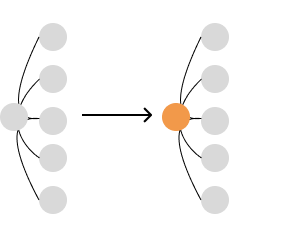

## Seeing State as a Tree

So far, many terms have been used to describe to global state. Things like database and SSOT (single source of truth). But for memoization, the most important descriptor is a tree data structure.

A state update is commonly referred to as an update of a JavaScript object. But temporarily, reframe what that means: Think of it as a mutation of nodes in a tree data structure. Moving forward, a colored node will denote a node that will fail strict equality; either a change in value, reference, or both.

The following is a small, normalized, state tree.

```typescript
export const normalizedState = {
  docs: {
    1: {
      title: "Performant React",
      id: 1,
      updatedAt: 1668117919710,
    },
    2: {
      title: "React Presentation",
      id: 2,
      updatedAt: 1636582015583,
    },
  },
  docIds: [1, 2],
  app: {
    mounting: false,
  },
};
```

A tree representation would look like this


## Update Operations

A new tree is required when updating state. For React, the minimum criteria is replacement of the root node. Subtree nodes (the values) don't have to change. Revisit the reducer function in `makeProvider`.

```typescript
const reducer = (state, action) => ({
  ...state,
  ...action(state),
});
```

The spread operator performs a shallow merge. Think of this operation as the creation of a new root node for the state tree. An empty object `dispatch` would represent a new state tree with no other node changes.

```typescript
dispatch(() => ({}));
```



[fig 1] The root node mutation after `reducer` computation

## State Tree Mutations Using Code

A dispatch function's algorithm is the programmer's tool to transform a state tree. Let's visualize how various algorithms transform the tree.

Ex. 1
This algorithm creates a new `docs` node (`Object.entries`). All subnodes in `docs` are also replaced with new nodes. Note that only one node has changed its value, but all of them have been replaced.

```typescript
const updateDate = (newDate, currId) => {
  dispatch((state) => {
    return {
      docs: Object.fromEntries(
        Object.entries(state.docs).map(([id, doc]) => ({
          ...doc,
          date: currId === id ? newDate : doc.date,
        }))
      ),
    };
  });
};
```


Ex. 2
This algorithm is functionally identical. But now that we're thinking about node transformations, they are worlds apart. This transformation strategy will return the same subnode if the `id` is different.

```typescript
const updateDate = (newDate, currId) => {
  dispatch((state) => {
    return {
      docs: Object.fromEntries(
        Object.entries(state.docs).map(([id, doc]) => {
          if (id === currId) {
            return {
              ...doc,
              date: doc.date,
            };
          }
          return doc;
        })
      ),
    };
  });
};
```


## Optimizing State Tree Mutations

From an algorithmic perspective, useless node replacements have [virtually] no runtime difference. But in React, rerenders, one of the heaviest operation in React, are done by checking for node changes.

Useless node changes will also impact our [pending] memoization strategy. As you will discover in the future, useless node updates equate to useless rerenders. To put it succinctly, tree transformation strategies make or break React apps.

In the previous examples, example #2 is clearly the superior approach. It minimizes the number of node changes required to create the desired state tree.

## Tree traversal with selectors

In the same way we represent tree transformations with algorithms, we do the same for accessing specific nodes in the tree. The selector model is designed for this. The single argument is *always* the entire state tree.

Back in the world of JavaScript, we describe a selector function's argument as the `state` tree and the return value is a node. To return the `docs` node, the selector would be:

```typescript
const getDocs = (state) => state.docs;
```

`getDocs` traverses the tree (down one level) to select the `docs` node.


## Traversing dynamic nodes with factory selectors

It is straightforward to target deterministic nodes, like with `getDocs`. But the subnode key values are determined in runtime. This problem is compounded by the fact that the selector model has a single argument. These two problems are solved by creating a curried function that returns a selector. Moving forward, I will call them factory functions.

The subnodes of the `docs` key are ids. So the factory function's argument needs to have this be passed in at runtime. 

```typescript
const makeGetDocById = (id) => (state) => state.docs[id];
```

In the case of accessing an `id` of `1`, the tree traversal would look like the following.

```typescript
makeGetDocById(1);
```


## Composing selectors
The consistent interface of selectors mean that they can be built on top of each other. This displays one of the most powerful properties of this design philosophy. Selectors are infinitely reusable in other selectors. As applications (and its algorithms) grow in complexity, infinite reusability becomes invaluable.

The `makeDocById` can also be written using `getDocs`.

```typescript
const makeGetDocById = (id) => (state) => {
  const docs = getDocs(state)
  return docs[id]
  };
```


