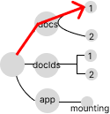

# State tree mutations and traversal

## Seeing State as a Tree

Algorithms and functions are used interface with `state`. But visualizing these operations as tree transformations and node access is a superpower that is a hidden in plain sight.

Moving forward, a colored node will denote a node that will fail strict equality; either a change in value, reference, or both. The following is a small, normalized, state tree.

```typescript
export const normalizedState = {
  docs: {
    1: {
      title: "Performant React",
      id: 1,
      updatedAt: 1668117919710,
    },
    2: {
      title: "React Presentation",
      id: 2,
      updatedAt: 1636582015583,
    },
  },
  docIds: [1, 2],
  app: {
    mounting: false,
  },
};
```

A tree representation would look like this


## Optimizing State Tree Mutations

Minimizing node replacements during tree transformations is imperative. Reconciliation, React's rerender analyzer, checks for node changes. Useless node updates equate to useless rerenders.

Minimizing tree transformations takes complete priority. The performance of the transformation algorithm is almost never important. After all, algorithms should be assumed to be fast, until proven otherwise.

In the previous examples, example #2 is clearly the superior approach. It minimizes the number of node changes required to create the desired state tree.

## Update Operations

Root node replacement is the minimum criteria for a state update in React. Subtree nodes (the values) don't have to change. Revisit the reducer function in `makeProvider`.

```typescript
const reducer = (state, action) => ({
  ...state,
  ...action(state),
});
```

The spread operator creates a new object. This object creation is conceptually the same as a new root for `state`. An empty object `dispatch` represents this.

```typescript
dispatch(() => ({}));
```


[fig 1] The root node replacement after `reducer` computation


## Tree Transformation Algorithm Analysis 

Transforming a tree with an algorithm is easy. But picking the best transformation algorithm is hard. It requires a developer to analyze the code and understand what is happening to the nodes in the tree.

Here is a comparison between two algorithms that modify a single value (the `date` key) in `state`. The resulting values will be the same, but they are completely different in their node transformations.

In this algorithm, every single subnode in `docs` is shallow merged (AKA node replacement). This results in an excessive number of useless node changes.

```typescript
const updateDate = (newDate, currId) => {
  dispatch((state) => {
    return {
      docs: Object.fromEntries(
        Object.entries(state.docs).map(([id, doc]) => ({
          ...doc,
          date: currId === id ? newDate : doc.date,
        }))
      ),
    };
  });
};
```


The following transformation algorithm is almost identical. But in terms of node replacements, they are worlds apart. The specific node in question is surgically replaced, via conditional shallow merge. No other nodes are affected.

```typescript
const updateDate = (newDate, currId) => {
  dispatch((state) => {
    return {
      docs: Object.fromEntries(
        Object.entries(state.docs).map(([id, doc]) => {
          if (id === currId) {
            return {
              ...doc,
              date: doc.date,
            };
          }
          return doc;
        })
      ),
    };
  });
};
```


## Tree traversal with selectors

A selector is a function that is designed to traverse the `state` tree and access nodes of interest. This is analogous to reducer functions, which are designed to transform the `state` tree. A selector is a function whose argument is the entire `state` tree, and return value is, for the time being, a node in the `state` tree. To return the `docs` node, the selector would be.

```typescript
const getDocs = (state) => state.docs;
```

`getDocs` traverses the tree (down one level) to select the `docs` node.


## Traversing dynamic nodes with factory selectors

Curried selectors (factories) are required to traverse the tree to target dynamic nodes. For example, the `docs` subkeys are `ids`, which are determined at runtime. Accounting for new arguments (`id`) requires arguments to be split, via factory selectors.

```typescript
const makeGetDocById = (id) => (state) => state.docs[id];
```

In the case of accessing an `id` of `1`, the tree traversal would look like the following.

```typescript
makeGetDocById(1);
```



## Composing selectors

Selectors can be combined and/or stacked to any level of complexity. This is true by definition, because selectors have a consistent and predictable interface (the `state` tree). As applications (and its algorithms) grow in complexity, infinite reusability becomes invaluable.

For sake of example, `getDocs` can be easily integrated into `makeDocById`.

```typescript
const makeGetDocById = (id) => (state) => {
  const docs = getDocs(state);
  return docs[id];
};
```
