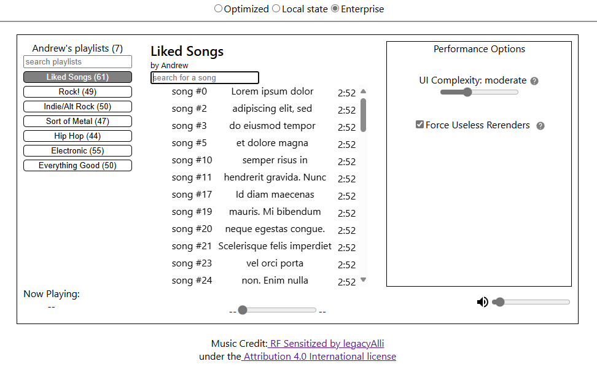
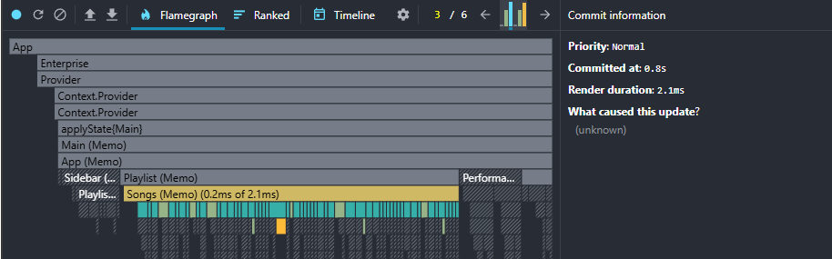
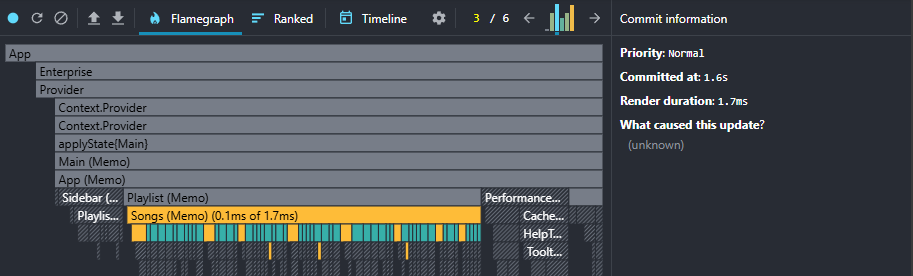
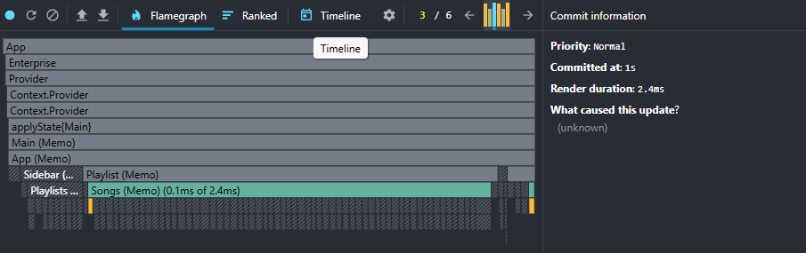
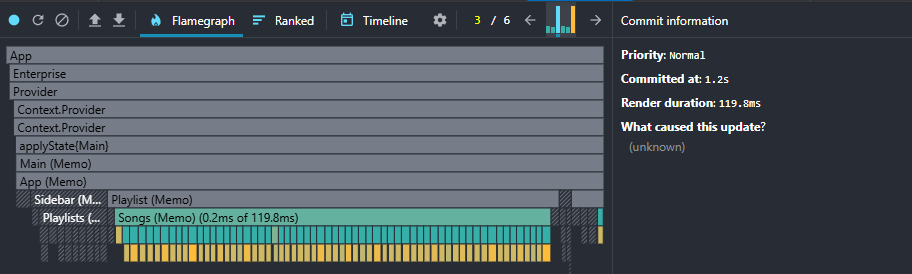
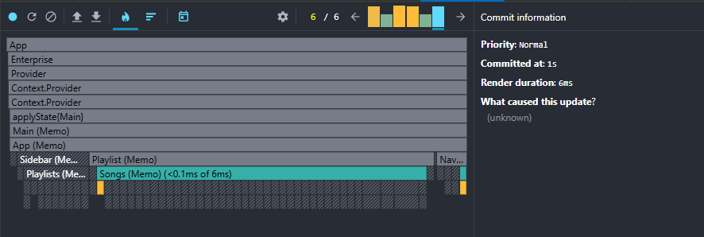
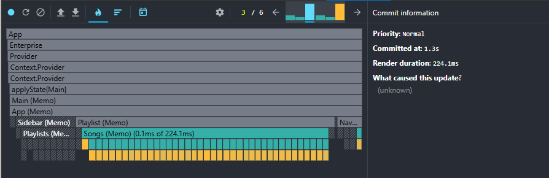

# Make React Fast Again Part 4: Scaled Up Application Analysis

## Introduction

When designed correctly, UI applications can be fast, [SOLID](https://en.wikipedia.org/wiki/SOLID), and scale to any level of complexity.

This is the last step, where I put my money where my mouth is and prove that this works as well as I say it does. That it scales in situations where conventional approaches crumple like paper.

A sample application will be benchmarked. Its architectural properties will be analyzed to understand this approach's practicality and effectiveness.

## Component Initial Render Performance

There is constant talk about *re*render suppression, because the very first render cycle, the mounting process, is fundamentally impossible to optimize with these techniques. There are other tricks in the bag of tools for this (such as virtualization), but there is no structural framework or concrete rules on when to use them.

Despite this, learning these concepts is invaluable, because these performance optimizations still drastically improve the user experience because:

1. The initial mounting phase of a component is usually not the only render that occurs during the startup phase of the app. Most applications rerender hundreds of times before the application is ready for the user to interface with.
2. The responsiveness increases drastically after all of the UI is fully mounted.

Whenever optimization and rerender suppression is discussed, there is always the qualifier of "useless". Because every component, regardless of how it is design, has at least one: The mounting process. There is no if, ands or buts: If the UI is complex, no design strategy exists that will speed up the creation of HTML or the algorithms that power them. The best option to address massively complex UI is virtualization. But virtualization can also create its own set of problems. Deferring UI mounting until it is seen is an amortization process. If the mounting process is slow for those virtualized elements, responsive actions (like scrolling) will be hurt.

## The Local State _Could_ be Faster

The local state implementation of the music player has a god component that controls every rule in the application. Upon closer inspection, there are certainly places where data could be managed in parts lower in the component hierarchy, which would isolate rerenders to specific parts of the app. But therein lies multiple problems.

1. Each feature becomes its own unique case study on where the optimal location is to store data.
2. Future requirement changes will create risky refactors if data is necessary in higher areas of the component hierarchy.

Enterprise software is difficult enough to maintain in its own right. A constant conflict between maintainability and performance only makes it worse.

When an external force, that does not have a developer's interest in mind, is dictating foundational design of the code, this spells the beginning of the end for large applications.

That's not to say that the performant approach does not have rules, but they are good rules because they are within the best interests of the developers.

1. This structured system is one-size-fits-all in an overwhelming number of situations. Exceptions are few and far between.
2. Data-availability refactors are never required

Maintainability and performance now run in parallel. The best interests of the developers are there

- Inherent separation of data and UI
- A majority of the application's data rules and algorithms are functionally pure and can be memoized
- Memoization has safeguards to prevent stale values and can be universally used
- Changing business requirements rarely impact architecture and data management decisions
- Data availability is not a concern
- A team's shared understanding of the application's architecture makes the system more understandable
- High performance is ensured or can be easily refactored to be performant

## Benchmarks

The application is a stripped-down music player, whose design isn't going to be winning any awards. What's more important to focus on is the responsiveness of the UI in various parts of the app, as well as how it changes as the app scales in complexity.

## Keystroke Benchmarks

Something as simple as an input can be the worst user experience in an application. Keystrokes fire many times in sequence and gives constant user feedback during the process. Performance is important when users directly feel slowdowns.

When observing complexity, keystroke speed differences are negligible. Low complexity nets the similar speeds: 0.8ms vs 2.1 ms.

The story changes when the app scales. Artificially scaling up complexity causes useless rerenders rears to rear its ugly head. Now it's 2.4 ms vs 119ms.

Bumping it up to the highest complexity. The scaling difference cannot even be compared: 6ms vs 224ms. Keep in mind that this is _per_ keystroke. The un-optimized app is virtually unusable.

## Other Operation Benchmarks

Other parts of the app benefit equally. Performance differences at extreme complexity are colossal. But the level of complexity isn't realistic for most applications. Benchmarks analysis will use medium complexity.

Here are some statistics for the nerds. For the non nerds, here is the summary: On average, the

- Average speed increase: 100%
- Lowest speed increase: 30%
- Highest speed increase: 400%

x-axis: slowdown rate
y-axis: render speed

optimized and slow rerender scaling lines on same graph

- mounting + subsequent render cycle speed graph

As you can see from the graphs, mounting is slow and then the UI becomes fast
In the unoptimized application, mounting is slow and continues to be slow.

- keystroke searching
- switching playlists
- toggling play states

- Talk about:

- responsiveness scaling change
- objective comparison of speeds

## Conclusion

Writing high-performance applications becomes easy when working with a set of structured rules. The only hard part about this system is understanding state tree mutations. After that, the only thing that is asked out of developers is discipline (which is much easier to attain than intelligence).

The first app you write won't be taken to the bleeding edge, because all of this takes time and practice. There are multiple concepts to juggle all at once: Effective memoization (state tree mutations) and mindful component design. There are, of course, other considerations to make when it comes to performance woes.Strategies like debouncing, throttling, and virtualizing are still important. But mindful application design that is inherently fast is the foundation on which these optimizations sit on top of.
