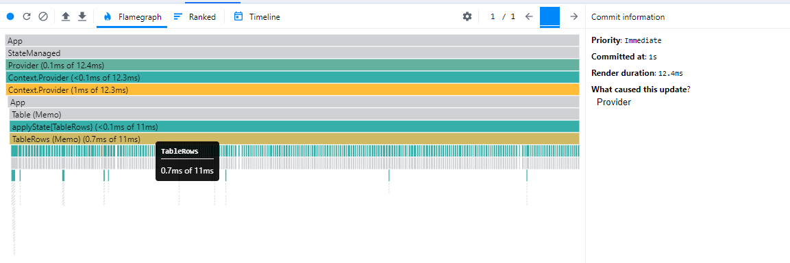
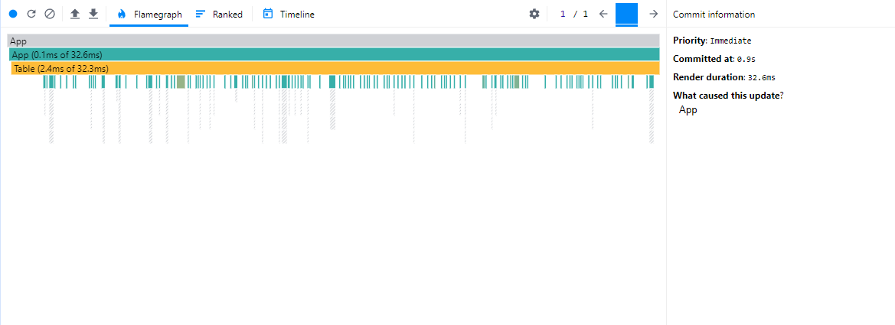
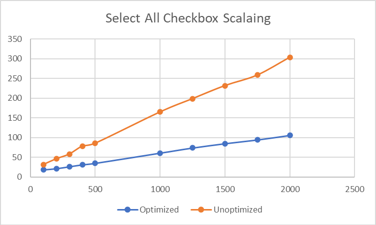

# Make React Fast Again Part 1: Reconciliation and Component Design

## React can be fast

It really is a shame that there is no style guide. The freedom to do whatever you want is the freedom to create poor experiences for users of your application. One of the biggest mistakes that is made, almost without fail, is poor performance. The core architecture of many apps inevitably out-scale itself. React apps start fine, but slowly accumulate performance problems. But make no mistake: React is not inherently slow. But it is easy to make architectural decisions that make it slow.

I want to set the record straight and show you the true potential of React. I would not be arrogant enough to say that my way is the definitive approach. I am only here to show you one way that I have developed through personal experience. It has been proven itself in my personal and professional projects that I develop at TikTok.

But this is not easy to teach. It requires a deep understanding of React, data structure mutations, and established design patterns. The first step is to learn what the [virtual DOM](https://legacy.reactjs.org/docs/faq-internals.html) is and the [reconciliation algorithm](https://legacy.reactjs.org/docs/reconciliation.html).

## The Virtual DOM

The virtual DOM is React’s approach to high-performance DOM changes. The virtual DOM is an un-rendered representation of the previous DOM state. When a change occurs, optimal transformation strategies are performed by comparing the virtual DOM to the DOMs next incoming state.

The comparison process utilizes the reconciliation algorithm. The DOM diffing process of a mounted component is commonly referred to as a rerender. When a component rerenders, its children (at all levels of nesting) trigger render cycles. Render cycles are triggered when data is updated (usually with the [`useState`](https://react.dev/reference/react/useState) hook).

This rendering strategy can create crippling performance issues in large applications. Rerender propagation is an obfuscated process for the untrained eye. When, why, and where rerenders are is lost in the sauce for large applications.

Rerenders are not inherently bad. After all, they are necessary for an application to be responsive. It is when rerenders occur many times and, most importantly, when they are triggered in unnecessary places.

## Leveraging React Developer Tools

Discovering performance woes is easy (fixing them is another story) with the browser extension [React Developer Tools](https://chromewebstore.google.com/detail/react-developer-tools/fmkadmapgofadopljbjfkapdkoienihi?pli=1). It has a performance profiler that visualizes component render cycles, via flame graph.

To visualize this, a small application is needed. This app has a button that increments a counter and a basic table implementation. Note that this table, on a conceptual level, is unrelated to the button and its incrementing UI.

```jsx
import React, { useState } from "react";
import ReactDOM from "react-dom";

const App = () => {
  const [counter, setCounter] = useState(0);

  return (
    <div>
      <button onClick={() => setCounter((prev) => prev + 1)}>
        increment ({counter})
      </button>
      <Table />
    </div>
  );
};

const Table = () => (
  <table>
    <tbody>
      {Array(5)
        .fill(null)
        .map((_, i) => (
          <Row idx={i} key={i} />
        ))}
    </tbody>
  </table>
);

const Row = ({ idx }) => (
  <tr>
    <td>{idx}</td>
  </tr>
);

ReactDOM.render(
  <App />,
  // assuming you have an html file with a <div id="root" />
  document.getElementById("root")
);
```

A button click triggers a render cycle by invoking `setCounter`. Visually, `App` has experienced a DOM update. But reconciliation is diffing more DOM nodes than one might expect.

No `props` are passed down to `Table` and `Row`. It is fundamentally impossible for these components be affected by `App`'s state change. But cascading rerenders down to child components is the default behavior. Updating `App` causes reconciliation to trigger in unnecessary locations. This consumes precious resources on the client.


Imagine one state change triggering useless render cycles on hundreds DOM elements. What if something trivial like an `input` did this on every keystroke? This is the silent killer of enterprise software.

There is a de facto solution exists for useless rerender suppression: `React.memo`. It performs a shallow equality check (JavaScript's strict equality operator) on all incoming `props` from the parent component. In the sample code, simply wrapping the child components with it suppresses the useless rerenders.

```jsx
import React, { useState } from "react";
import ReactDOM from "react-dom";

const App = React.memo(() => {
  // ...
});

const Table = React.memo(() => (
  // ...
));

const Row = React.memo(({ idx }) => (
  // ...
));

ReactDOM.render(
  <App />,
  // assuming you have an html file with a <div id="root" />
  document.getElementById("root")
);
```

The flame graph has changed. There are now gray cells. These represent components that did not rerender during a particular render cycle in the app.


It would be naive to think that we're done. Any professional developer knows that this example looks nothing like enterprise software. We need to develop a full-scale architecture in order to leverage the power of `React.memo` in apps that render thousands of DOM nodes and trigger hundreds of heavy render cycles (possibly thousands) per minute.

## Check out the demo

Seeing is believing. The rest of the article will refer to an basic app. It can be run in your own personal environment, which can be cloned from this [repo](https://github.com/andrew1007/mrfa-demo/tree/main) (type definitions included).

## God components are slow

In order to see what a fast implementation looks like, first we need to look at one that is slow.

Here is the god component of a searchable, filterable, and selectable table using local state. Because data is required in many locations, this god component needs to manage data and event handlers. Data needs to be passed down from the top of the component hierarchy.

```jsx
import { useEffect, useState } from "react";
import Filter from "./Filter";
import Table from "./Table";
import { fetchColumns, fetchFilters, fetchRows } from "../resources/requests";

const App = () => {
  const [rows, setRows] = useState([]);
  const [columns, setColumns] = useState([]);
  const [filters, setFilters] = useState([]);
  const [searchText, setSearchText] = useState("");
  const [focusedFilter, setFocusedFilter] = useState("");
  const [selected, setSelected] = useState([]);

  // load data from mock api on mount
  useEffect(() => {
    Promise.all([fetchRows(), fetchFilters(), fetchColumns()]).then(
      ([rows, filters, columns]) => {
        setRows(rows);
        setColumns(columns);
        setFilters(filters);
      }
    );
  }, []);

  // compute which rows match the current search + filter criteria
  const getFilteredRows = () => {
    const currentFilter = filters.find(({ id }) => id === focusedFilter);
    if (!currentFilter && !searchText) {
      return rows;
    }

    return rows
      .filter((row) =>
        currentFilter?.conditions.every(
          (cond) => row[cond.key] === cond.value
        ) ?? true
      )
      .filter(({ name }) => name.includes(searchText));
  };

  // update text in cell
  const handleCellEdit = ({ id, key, value }) => {
    setRows((prevRows) => {
      return prevRows.map((row) => {
        if (row.id === id) {
          return { ...row, [key]: value };
        }
        return row;
      });
    });
  };

  // toggle a row checkbox
  const toggleCheckChange = (id) => (e) => {
    if (e.target.checked) {
      return setSelected((prevSelected) => [...prevSelected, id]);
    } else {
      return setSelected((prevSelected) =>
        prevSelected.filter((selectedId) => selectedId !== id)
      );
    }
  };

  // toggle checkbox that selects/deselects all
  const toggleCheckAll = () => {
    if (selected.length === rows.length) {
      setSelected([]);
    } else {
      setSelected(rows.map(({ id }) => id));
    }
  };

  return (
    <>
      <Filter
        options={filters}
        onFilterChange={setFocusedFilter}
        onSearchChange={setSearchText}
        searchText={searchText}
      />
      <Table
        rows={getFilteredRows()}
        columns={columns}
        selected={selected}
        onEditCell={handleCellEdit}
        onCheck={toggleCheckChange}
        onAllCheck={toggleCheckAll}
      />
    </>
  );
};
```

It is telling about useless rerenders when inspecting the flame graph, On checkbox select and selecting new filter conditions, a complete rerender of the entire table occurs. When inspecting the props that are passed down from `App` to `Table`, you can see that it is fundamentally impossible to ever suppress rerenders; even if `Table` is wrapped in a `React.memo`. `getFilteredRows()`, `handleCellEdit`, `toggleCheckChange`, and `toggleCheckAll` fail reference equality on every render cycle.


Technically, this could be solved with `useCallback` and `useMemo`. But these should be avoided as often as possible. They are brittle to use and must be vigilantly maintained. These hooks rely on a dependency array, which is susceptible to ineffective memoization and returning stale values.

Traditional performance techniques, like `useCallback` and `useMemo`, inevitably become liabilities in large applications. All of these issues and considerations are a non-issue if a different data management design pattern is used. It starts with managing data outside of the component hierarchy: the Context API.

## Performant Context

The guiding principle of fast components is the minimization of UI relying on other UI for data. The more data is passed from parent to child, the harder it is to optimize. In order to directly pass data to the components that need it, the context API is needed.

Context is widely regarded as slow; with claims that it does not scale. This is a half-truth. Context is not intrinsically slow. What is slow is the downstream consequence of its usage in a React component. [`useContext`](https://react.dev/reference/react/useContext) triggers a rerender every time data updates. So, in reality, the perception of context "being slow" is actually commentary on the speed of the reconciliation algorithm.

This performance critique is based on the most common design pattern, which is calling `useContext` directly inside the UI component that needs the data. The key phrase is "UI component". Of course, `useContext` must be called in a component; but nothing is stopping us from using it in a component that has no HTML.

Here is a basic state management library that can be used to suppress rerenders. It is a scalable implementation that works in applications of any size. It leverages the following concepts:

- [`Context`](https://react.dev/reference/react/createContext) to store data.
- [`useReducer`](https://react.dev/reference/react/useReducer) to dispatch and transform state data.
- Higher order component to access context data and process data before it is passed to a component.

```jsx
import React, {
  createContext,
  useContext,
  useReducer,
} from "react";

const noop = () => null;

function makeProvider(initialState) {

  const StateContext = createContext(initialState);
  const DispatchContext = createContext(noop);

  // Provider component with state management hook
  const Provider = ({ children }) => {
    const reducer = (state, action) => ({
      ...state,
      ...action(state),
    });

    const [state, dispatch] = useReducer(reducer, initialState);

    return (
      <DispatchContext.Provider value={dispatch}>
        <StateContext.Provider value={state}>
          {children}
        </StateContext.Provider>
      </DispatchContext.Provider>
    );
  };

  // HOC to connect state to components
  function applyState(mappedState) {
    return (Component) => {
      const MemoComponent = memo(Component);
      const ApplyStateComponent = (props) => {
        const mappedStateInstance = useMemo(() => mappedState?.(), []);

        const state = useContext(StateContext);
        const combinedProps = {
          ...props,
          ...mappedStateInstance?.(state, props),
        };

        return <MemoComponent {...combinedProps} />;
      };
      ApplyStateComponent.displayName = `applyState{${Component.name}}`;
      return ApplyStateComponent;
    };
  }

  const useDispatch = () => useContext(DispatchContext);

  return {
    applyState,
    Provider,
    useDispatch,
  };
}

export default makeProvider;
```

The high order component `applyState` is the secret sauce. `applyState` acts as a proxy for context access. Components never have direct access to context. `applyState` accepts a function resolver, allowing data processing before it is passed down to the component. `useContext` is still called in `applyState`. The higher order component always gets rerendered. But the computational overhead of each `applyState` is miniscule compared to a rerender of a component with DOM nodes.

By strategically parsing, extracting, and computing data inside `applyState`, `React.memo` (which is embedded in `applyState`) can properly detect and suppress useless rerenders. The interface of `applyState` is akin to [`connect`](https://react-redux.js.org/api/connect) in `redux`. The function resolver is essentially `mapStateToProps`.

The `dispatch` function is in its own context and directly exposed (via `useDispatch`). This is because `dispatch` is a stable dependency. It is safe to use as a hook directly in components because it will never trigger a rerender. The full state tree is available in the callback argument. You can think of this `dispatch` pattern as a (less powerful) thunk that can be directly called in a component.

This is one step closer to applying this to enterprise software. But we aren't there yet. There is an art to meeting strict equality for all incoming data as often as possible.

## Optimized Component Design

With the prerequisite knowledge out of the way, we can finally get started with component design. Designing optimized components is about creating a logical separation of UI elements based on the data they use. Size of a component is not the causation of optimized components; it is a correlation.

### Reference data using ids

Make no mistake: passing data down from parent to child is oftentimes required. However, making strategic decisions on what to pass down is the difference between the optimized and naive approach.

In a majority of cases, only `id` needs to be passed down from parent to child. As long as `state` is well-structured (normalized), this should be the only thing necessary to get the necessary information. This concept will be leveraged heavily. For sake of example simplicity, the code snippet doesn't include the search/filtering algorithm.

```jsx
import React from "react";
import TableRow from "./TableRow";

const TableRows = (props) => {
  const { rowIds } = props;
  return (
    <>
      {rowIds.map((id) => {
        return <TableRow id={id} key={id} />;
      })}
    </>
  );
};

const mappedState = () => (state) => ({
  rowIds: state.rowIds,
})

export default applyState(mappedState)(TableRows);
```

### Compute to primitives outside of UI

The easiest way to maximize strict equality is to only pass primitives. This can be seen with the implementation of `RowCheckbox`. The resulting `checked` `boolean` changes far less often than the array of selected checkboxes. By reducing this data into a `boolean` in the function resolver of `applyState`, it is an easy win.

```jsx
import { applyState } from "./StateManager";

const RowCheckbox = (props) => {
  const { checked } = props;

  // Don't worry about this handler. We're concentrating on the pre-computation aspect of this code snippet
  const toggleCheck = (e) => null

  return <input onChange={toggleCheck} type="checkbox" checked={checked} />;
};

const mappedState = () => (state, ownProps) => ({
  checked: state.selected.includes(ownProps.id),
});

export default applyState(mappedState)(RowCheckbox);
```

### Isolate un-optimizable UI

The rows to render is dynamic because of search and filtering. `rowIds`, always fails strict equality, which triggers a rerender on every state update. This useless rerender is virtually unavoidable, based on our (currently) limited knowledge set. But there is a way around this. Isolate this difficult-to-suppress operation from the rest of the system. Make sure that the children of this component are designed in a way to minimize propagating render cycles. In this common situation, it is easily done by only passing down `id`.

```jsx
import React from "react";
import { applyState } from "./StateManager";
import TableRow from "./TableRow";

const TableRows = (props) => {
  const { rowIds } = props;
  return (
    <>
      {rowIds.map((id) => {
        return <TableRow id={id} key={id} />;
      })}
    </>
  );
};

const getFilteredRowIds = (state) => {
  const { filters, focusedFilter, rows } = state
  const currentFilter = filters.find(({ id }) => id === focusedFilter);
  if (!currentFilter) {
    return rows;
  }

  return rows
    .filter((row) =>
      currentFilter?.conditions.every(
        (cond) => row[cond.key] === cond.value
      ) ?? true
    )
    .map(({ id }) => id)
};

const mappedState = () => (state) => {
  return {
    rowIds: getFilteredRowIds(state),
  }
};

export default applyState(mappedState)(TableRows);
```

Inspection of the flame graph shows the result. Completely isolating this data computation allows guaranteed strict equality failure with virtually no consequence. A 0.7 ms rerender speed is miniscule. On top of that, the rerender overhead of this component stays constant, regardless of the number of `TableRow` elements that are rendered (within reason). A UI render cycle occurs on *any* state update, but it does not meaningfully affect performance.



### Isolate zero-dependency and static UI

It is ideal to group zero-dependency UI into a separate component; they will never have a reason to rerender itself, nor propagate rerenders down to its children. In this use case, `table`, `tbody` and `tr` for the column headers never change, so it makes sense to group them into a component that do not accept nor provide any data. The DOM nodes in this component will never have a reason to be checked for differences. Remember to wrap these types of components in `React.memo`.

```jsx
import React from "react";
import TableColumns from "./TableColumns";
import AllCheckbox from "./AllCheckbox";
import TableRows from "./TableRows";

const Table = () => {
  return (
    <table>
      <thead>
        <tr>
          <td>
            <AllCheckbox />
          </td>
          <TableColumns />
        </tr>
      </thead>
      <tbody>
        <TableRows />
      </tbody>
    </table>
  );
};

export default React.memo(Table);
```

### Tightly scope event handlers and data

In most cases, it is better to have data close to the UI that use it. `RowCell` is a good case study for how this can be done. In most cases, it is better to create event handlers in the locations where they are used. It is also better to extract data from state where it is used. In most cases, only the `id` should be necessary for this. But in the case of individual cells, the name of the column is also required. The `TableRow` needs to pass down the column name. In order to do this, `TableRow` needs to know what `columns` to render.

```jsx
import { applyState } from "./StateManager";
import React from "react";
import RowCheckbox from "./RowCheckbox";
import RowCell from "./RowCell";

const TableRow = (props) => {
  const { columns, id } = props;

  return (
    <tr>
      <td>
        <RowCheckbox id={id} />
      </td>
      {columns.map(({ key }) => <RowCell key={key} field={key} id={id} />)}
    </tr>
  );
};

const mappedState = () => (state) => {
  return {
    columns: state.columns,
  };
};

export default applyState<TableRowProps>(mappedState)(TableRow);
```

With the necessary identifiers to get the current data value, the data to render can now be computed inside `applyState`'s function resolver. In this use case, the value is a string, which will suppress useless rerenders.

```jsx
import { applyState, useDispatch, Row } from "./StateManager";
import React from "react";
import EditableCell from "../resources/EditableCell";

const RowCell = (props) => {
  const { value, id, field } = props;
  const dispatch = useDispatch();

  const handleEdit = (value) => {
    dispatch((prevState) => {
      const nextRows = { ...prevState.rows };
      nextRows[id] = {
        ...nextRows[id],
        [field]: value,
      };

      return {
        rows: nextRows,
      };
    });
  };

  return (
    <EditableCell value={value} onConfirm={handleEdit} />
  );
};

const mappedState = () => (state, ownProps) => {
  const { rows } = state;
  const { field, id } = ownProps;
  return {
    value: rows[id][field],
  };
};

export default applyState(mappedState)(RowCell);
```

## Performance scaling

The rerender overhead of typical architectures scale linearly. If rerenders are not suppressed, twice the amount of HTML means twice the number of nodes that the reconciliation algorithm needs to diff. This problem is compounded when algorithms are constantly recomputed on rerenders. But this is a non-issue when useless rerender suppression strategies are utilized. In many cases, complexity increases have no impact on responsiveness.

This can be seen by comparing the performance as the table grows algorithmic complexity. As the resource requirements grows, the god component's responsiveness scales into the stratosphere. The optimized app, on the other hand, is resistant to scaling issues.

Here is a comparison for ticking the table's "All" checkbox. With the unoptimized app, render time is 32.6 ms.


In the optimized app, it is a render speed of 16.7 ms. A substantial improvement.


To see how it truly scales, we can insert an algorithm to artificially slow down the app. The following function will be run in every cell on each render cycle.

```javascript
const heavy = () => {
  for (let i = 0; i < 100; i++) {
    JSON.stringify({});
  }
};
```

Here are how the render cycle speed changes, as the number of iterations increases. Any responsiveness slower than 50 ms is typically considered to be intrusive to the user experience.

|Iterations | Optimized (ms)   | Unoptimized (ms) |
|-----------|------------------|------------------|
|100        |16.7              |32.6              |
|200        |21.7              |46.2              |
|300        |26.6              |58.2              |
|400        |31.5              |78.2              |
|500        |35.3              |85.7              |
|1000       |61.1              |165               |
|1250       |74.1              |198.7             |
|1500       |85.1              |231.8             |
|1750       |94.6              |258.7             |
|2000       |106               |303.7             |



## Algorithms Outside of UI

Front-loading the computation in `applyState`, which recomputes on every render cycle, may seem like an unnecessary use of client resources. It may seem alluring to pass the pass the entire subtree to the component and compute inside the component. This way, useless computations would be circumvented.

For example, if the algorithm in `getFilteredRows` existed inside `TableRows`, strict equality would be met more often (as opposed to never met).

```jsx
import { applyState } from "./StateManager";
import React from "react";
import TableRow from "./TableRow";

const TableRows = (props) => {
    const { filters, focusedFilter, searchText, rows, rowIds } = props
    const currentFilter = filters.find(({ id }) => id === focusedFilter);

    const filteredRowIds = rowIds.filter((rowId) =>
        currentFilter?.conditions.every(
            (cond) => rows[rowId][cond.key] === cond.value
        ) ?? true
    )
        .filter((rowId) => rows[rowId].name.includes(searchText));

    return (
        <>
            {filteredRowIds.map((id) => {
                return <TableRow id={id} key={id} />;
            })}
        </>
    );
};

const mappedState = () => (state) => {
    const { filters, focusedFilter, searchText, rowIds, rows } = state
    return { filters, focusedFilter, searchText, rowIds, rows }
};

export default applyState(mappedState)(TableRows);
```

This true, but impractical. Maintainability, in an overwhelming number of cases, comes first for enterprise software. Algorithms in components violate separation of concerns and they cannot be reused in other locations. On top of that, there is already a solution for this. Functional (pure) memoization strategies enable patterns that are robust, extremely effective (when used correctly), and reusable. There is no denying that memoization has performance penalties. But the impact is normally small and provides massive increases in scalability. It is almost always worth it.

## To be continued

With these concepts, typical web apps gain huge performance wins. This is only scratching the surface of the knowledge to write a fully optimized React app. To get the full picture, these topics need to be covered.

- Robust memoization strategies for computed data
- Structuring normalized state trees
- Dispatching optimal state transformations
