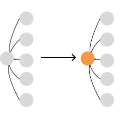
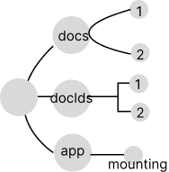
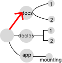
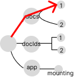
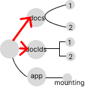

# Make React Fast Again Part 3: State tree mutations and algorithm memoization

## Introduction

Part 3 is about the concept

Understanding state tree transformations is so undervalued that the average developer doesn't think about (or even understand) it when designing an application. A mastery of this is a hidden superpower when working global state management systems.

It is the last piece of the puzzle to creating fast enterprise software using React. It scales infinitely. There's is no such thing as an application that is too large or complex. In fact, the true power of this design paradigm reveals itself in those situations.

###

Brittle, inflexible, and unstandardized memoization approaches are rife with hazards and weaknesses.

1. Some algorithms may seem "too complex" to memoize
2. Stale caches are a common source of silent errors

A structured framework for memoization fixes all of these.

1. Every global state algorithm, regardless of size or complexity, can be memoized.
2. It has inherent safeguards against stale caches. It is magnitudes harder to return them.
3. Cache hits are maximized in a deterministic and easy-to-reason way.
4. They are inherently pure functions.

## idk lol

In part 2, it may have seemed strange that selector functions, regardless of complexity, were decoupled from `useSelector`. This is for two reasons:

1. Pure functions are dead-easy to test
2. Memoization is easier to implement

Memoizing operations in data structures is the last piece of the puzzle for applications that are optimized and maintainable. But memoizing operations that are derived from (essentially) a mini database is difficult. It requires an intuitive understanding of how the state tree changes as data is mutated, added, and removed from it.

## Custom `createSelector`

For learning purposes, here is a custom implementation of a powerful memoization function. It has the core features of `createSelector`, from the package [`reselect`](https://www.npmjs.com/package/reselect).

```typescript
function createSelector(selectors, computingFn) {
  let computedSelectorCache = [];
  let cache;

  return (state) => {
    const computedSelectors = selectors.map((fn) => fn(state));
    const hasChanges = computedSelectors.some(
      (computed, idx) => computedSelectorCache[idx] !== computed
    );
    if (hasChanges) {
      cache = computingFn(...computedSelectors);
      computedSelectorCache = computedSelectors;
    }

    return cache;
  };
}
```

## `createSelector` Deconstructed

The following logic maximizes memoization effectiveness.

1. Prepare two caches: For computed resolver values and the function's return value

```typescript
function createSelector(selectors, computingFn) {
  let computedSelectorCache = [];
  let cache;

  /// ...
}
```

2. Compute the selectors, and compare the selector values from the previous invocation.

```typescript
function createSelector(selectors, computingFn) {
  let computedSelectorCache = [];
  let cache;

  return (state) => {
    const computedSelectors = selectors.map((fn) => fn(state));
    const hasChanges = computedSelectors.some(
      (computed, idx) => computedSelectorCache[idx] !== computed
    );
    // ...
  };
}
```

Selectors are pure functions. So if all selectors are computed and the resolved values are the same compared to the previous state, then the cached value can be safely returned. This is essentially a "pre-verification" of a datum's equality before it is available to the algorithm.

3. If there are changes, update the cache and return the new value

```typescript
function createSelector(selectors, computingFn) {
  // ...

  return (state) => {
    const computedSelectors = // ...
    const hasChanges = // ....
    if (hasChanges) {
      cache = computingFn(...computedSelectors);
      computedSelectorCache = computedSelectors;
    }

    return cache;
  };
}
```

If the selectors resolve to different arguments, then the `cache` recomputes.

## Seeing State as a Tree

Mutations are easiest to understand when `state` is conceptualized as a tree data structure. Moving forward, a colored node will denote a node that will fail strict equality; either a change in value, reference, or both.

A new state tree is required when updating state. But the word "new" isn't a granular descriptor. Only the root node needs to be replaced in order for it to be defined as a "new tree". Subtree nodes don't have to change reference nor value. The existing nodes just need to be connected to a new root node. Revisit the reducer function in `makeProvider`.

```typescript
const reducer = (state, action) => ({
  ...state,
  ...action(state),
});
```

The spread operator performs a shallow merge. Think of this operation as the creation of a new root node for the state tree.



[fig 1] The root node of the state tree being mutated after `reducer` computation

## Visualizing Resolver Functions

The hardest part about effective selectors is writing optimal resolver functions. It's helpful to think of a resolver function as an entity that "traverses" the state tree to access necessary nodes.

The following is a small, normalized, state tree.

```typescript
export const normalizedState = {
  docs: {
    1: {
      title: "Performant React",
      id: 1,
      updatedAt: 1668117919710,
    },
    2: {
      title: "React Presentation",
      id: 2,
      updatedAt: 1636582015583,
    },
  },
  docIds: [1, 2],
  app: {
    mounting: false,
  },
};
```

A tree representation would look like this



## Traversing the State Tree with Selectors

A selector function's argument is the `state` tree and the return value is a node. To return the `docs` node, the selector would be:

```typescript
const getDocs = (state) => state.docs;
```

`getDocs` traverses the tree (down one level) to select the `docs` node.



## Factory Selectors

A selector's single argument is `state`. Currying is required for extra parameters. This is common when a parameter is specified in runtime (such as an `id`). Here is an example that targets a child node in `docs`.

```typescript
const makeGetDocById = (id) => (state) => state.docs[id];

const getDoc = makeGetDocById(1);
```



## Composing Selectors

`createSelector`'s first parameter is an array of selectors, allowing the use of multiple selectors at once. This provides an intuitive way to access multiple state tree nodes.

`getDocs` and `getDocIds` are used together to compute the necessary data. This memoized selector will only recompute when either `docs` and/or `docIds` changes value.

```typescript
// resolvers
const getDocs = (state) => state.docs;
const getDocIds = (state) => state.docIds;

// pure selector
const getDocTitles = createSelector([getDocs, docIds], (docs, docIds) => {
  return docIds.map((id) => docs[id].title);
});
```



## Resolvers are Selectors

Computed selectors can be used as resolver functions. They are infinitely composable, reusable, and incur virtually no performance penalties (because they are memoized).

```typescript
const getDocTitles = createSelector([getDocs, docIds], (docs, docIds) => {
  return docIds.map((id) => docs[id].title);
});

const capitalize = (str) => `${str[0].toUpperCase()}${str.slice(1)}`;

// use computed selector in resolvers array
const getCapitalizedTitles = createSelector([getDocTitles], (titles) =>
  titles.map(capitalize)
);

const useGetCapitalizedTitles = useSelector(getCapitalizedTitles);
```

## `createSelector` Resolver Design

The hardest part about effective memoization is writing optimal resolver functions. They can make or break apps.

It is easy to accidentally create ineffective selectors. An obvious example would be targeting the root node. The root node is guaranteed to be a new node during any state update. This selector, `getState`, will always miss its cache and recompute.

```typescript
// useless resolver fn
const getState = (state) => state;

const makeGetParsedDocById = (id) =>
  createSelector([getState], (state) => {
    const { updatedAt, ...rest } = state.docs[id];
    return {
      ...rest,
      date: dayjs(doc.updatedAt).format("YYYY-MM-DD"),
    };
  });
```

Targeting `docs` node is better.

```typescript
const getDocs = (state) => state.docs;

const makeGetParsedDocById = (id) =>
  createSelector([getDocs], (docs) => {
    const doc = docs[id];

    return {
      ...doc,
      date: dayjs(doc.updatedAt).format("YYYY-MM-DD"),
    };
  });
```

But best of all, the resolver function can traverse deeper into the state tree and target the exact node of interest. Granular resolvers are almost always better. Accessing the exact nodes that are required for computation maximizes the effectiveness of this caching strategy.

```typescript
const makeGetDocById = (id) => (state) => state.docs[id];

const makeGetParsedDocById = (id) =>
  createSelector([makeGetDocById(id)], (doc) => {
    return {
      ...doc,
      date: dayjs(doc.updatedAt).format("YYYY-MM-DD"),
    };
  });
```

## Factory Selectors for Multi-cache situations

`createSelector` has a cache size of one. This meets most use cases. But some situations may require a larger cache. For example, when an algorithm needs to find data by id. This is common when rendering many component instances, such as a table or list of UI elements.

Without any extra techniques, `makeGetParsedDocById` would create a new selector instance (and a new cache) on every render cycle. This guarantees cache misses.

```tsx
const makeGetDocById = (id) => (state) => state.docs[id];

const makeGetParsedDocById = (id) =>
  createSelector([makeGetDocById(id)], (doc) => ({
    ...doc,
    date: dayjs(doc.updatedAt).format("YYYY-MM-DD"),
  }));

const useGetParsedDocById = (id) => {
  const getParsedDocById = makeGetParsedDocById(id);
  return useSelector(getParsedDocById);
};
```

A persistent cache can be created using `useMemo`. Using a memoization hook retains an instance of the selector for as long as possible.

```tsx
const useGetParsedDocById = (id) => {
  const getParsedDocById = useMemo(() => makeGetParsedDocById(id), [id]);
  return useSelector(getParsedDocById);
};
```

## Optimizing State Tree Mutations

State tree mutations matter. If nodes are needlessly changing, selectors cannot work their magic. Painstakingly targeting specific nodes is useless if nodes are needlessly changing.

Copying nodes with unchanged values is a common issue. This algorithm's intent is to update one node's value. But in reality, every node in `docs` updates. A cache miss occurs in every instance of `useGetDocById`. The dev tools profiler confirms this.

```typescript
const updateDate = (newDate, currId) => {
  dispatch((state) => {
    return {
      docs: Object.fromEntries(
        Object.entries(state.docs).map(([id, doc]) => ({
          ...doc,
          date: currId === id ? newDate : doc.date,
        }))
      ),
    };
  });
};
```


### An Optimal Transformation Approach

Transforming the single node is optimal. This transformation strategy targets the minimum number of nodes that require an update.

```typescript
const updateDate = (newDate, currId) => {
  dispatch(({ docs }) => {
    const nextDocs = { ...docs };

    nextDocs[currId] = {
      ...nextDocs[currId],
      date: newDate,
    };

    return {
      docs: nextDocs,
    };
  });
};
```


## Conclusion

The foundation is laid out. The only thing left is to practice until this is all second-nature.

It may be readily apparent that this scales to applications of any size... or maybe it doesn't seem apparent. To drive the point home, part 4 will drive the point home with an analyses and benchmarks of a fully functional React application: A music player.

Remember that most of the performance savings when memoizing are from rerender suppression. Algorithms are usually a non-issue.
