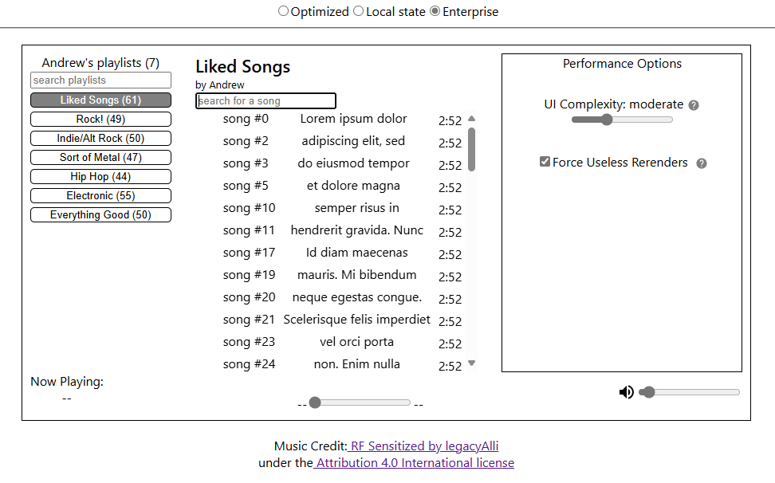
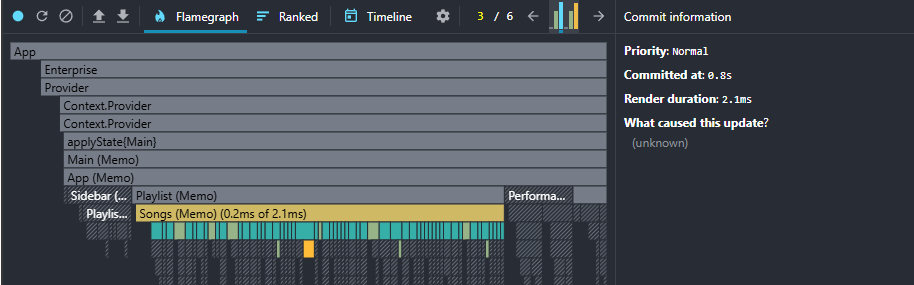

# Make React Fast Again Part 4: Full Scale Application Analysis

## Introduction

When designed correctly, UI applications can be fast, [SOLID](https://en.wikipedia.org/wiki/SOLID), and scale to any level of complexity.

This is the last step, where I prove that this works as well as I say it does. That it scales in situations where conventional approaches crumple like paper.

A sample application that can be dynamically scaled in complexity will be benchmarked and its various architectural properties will be analyzed to help understand this approach's practicality and effectiveness.

## Component Initial Render Performance

There is constant talk about *re*render suppression, because the very first render cycle, the mounting process, is fundamentally impossible to optimize with these techniques. There are other tricks in the bag of tools for this (such as virtualization), but there is no structural framework or concrete rules on when to use them.

Despite this, learning these concepts is invaluable, because these performance optimizations still drastically improve the user experience because:

- The initial mounting phase of a component is usually not the only render that occurs during the startup phase of the app. Most applications rerender hundreds of times during initialization.
- THe user responsiveness increases drastically after all of the UI is fully mounted.

Whenever optimization and rerender suppression is discussed, there is always the qualifier of "useless". Because every component, regardless of how it is design, has at least one: The mounting process. There is no if, ands or buts: If the UI is complex, no design strategy exists that will speed up the creation of HTML or the algorithms that power them. The best option to address massively complex UI is virtualization. But virtualization can also create its own set of problems. Deferring UI mounting until it is seen is an amortization process. If the mounting process is slow for those virtualized elements, responsive actions (like scrolling) will be hurt.

## Benchmarks

The application is a stripped-down music player, whose design isn't going to be winning any awards. What's more important to focus on is the responsiveness of the UI in various parts of the app, as well as how it changes as the app scales in complexity.

## Keystrokes

When looking at the complexity, the speed difference doesn't seem too bad for keystrokes. When the UI complexity is low, the speeds are essentially the same: 0.8ms vs 2.1 ms. Sure, it's twice as fast, but in reality a 2ms keystroke is fantastic performance

The story changes completely as the app scales. By artificially scaling up the complexity to moderate, the designs that create useless rerenders rears its ugly head. Now it's 2.4 ms vs 119ms.

Bumping it up to the highest complexity, where mounting slows to a crawl. The scaling difference cannot even be compared: 6ms vs 224ms.

x-axis: slowdown rate
y-axis: render speed

optimized and slow rerender scaling lines on same graph

- mounting + subsequent render cycle speed graph

As you can see from the graphs, mounting is slow and then the UI becomes fast
In the unoptimized application, mounting is slow and continues to be slow.

- keystroke searching
- switching playlists
- toggling play states

- Talk about:

- responsiveness scaling change
- objective comparison of speeds

## Conclusion

The first app you write won't be taken to the bleeding edge, because all of this takes time and practice. There are multiple concepts to juggle all at once: Effective memoization (state tree mutations) and mindful component design. There are, of course, other considerations to make when it comes to performance woes. If you inspect the audio player app carefully, you can see some of the optimization considerations that lie outside of rerender suppression. But this approach to designing React applications is a foundation on which all further performance optimizations sit on top of.
